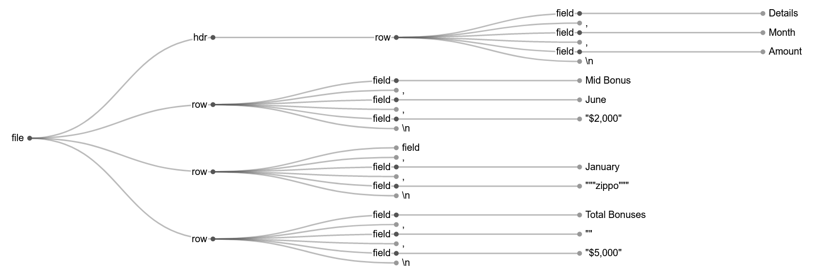

# js_antlr4_book
I'm working through some of the [The Definitive ANTLR4 Reference [1]](https://pragprog.com/titles/tpantlr2/the-definitive-antlr-4-reference/) book examples using the [JavaScript ANTLR4 runtime](https://github.com/antlr/antlr4/blob/master/doc/javascript-target.md) instead of the Java runtime. Note that the original example source code (all of the non .js and non .html files) was obtained from the [ANTLR4 book website](https://pragprog.com/titles/tpantlr2/the-definitive-antlr-4-reference/) and is covered by its own copyright. 

# grun.js
The grun test rig referenced in the book has been partially reimplemented in javascript as grun.js. The output of the -gui option of grun.js applied to the CSV example from Section 6.1 of the book is shown below.

[1] Par, Terence. "[The definitive ANTLR 4 reference.](https://pragprog.com/titles/tpantlr2/the-definitive-antlr-4-reference/)" *The Pragmatic Programmers* (2013).
